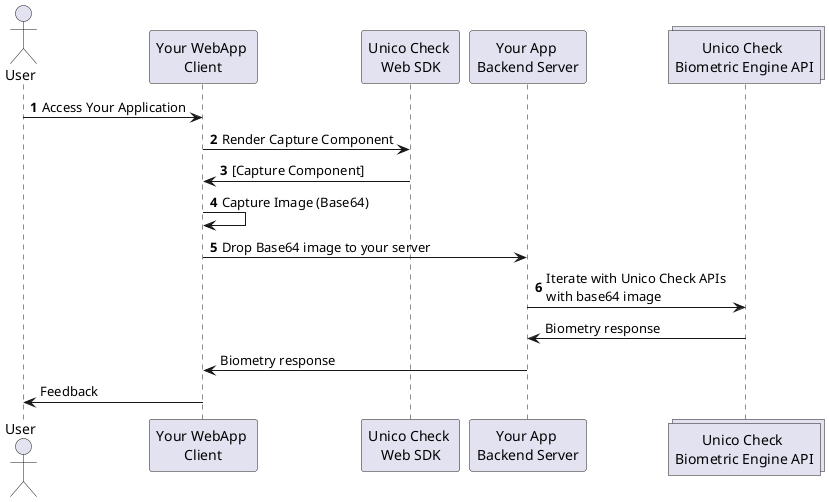

# Visão Geral

## Sobre este SDK

O SDK Web do **Unico Check** permite a construção, de forma rápida e fácil, de uma grande experiência de reconhecimento facial em seu web-app. Fornecemos um frame para a captura biométrica via JavaScript nativo utilizando algoritimos de abertura de câmera modernos e visão computacional, com o objetivo de auxiliar no enquandramento das imagens as otimizando para aumentar a acurácia na resposta do nosso motor biométrico.

Nosso SDK Web utiliza os recursos nativos do HTML 5, JavaScript e CSS e funciona em todos os browsers modernos.

## Compatibilidade

### Sistemas Operacionais

O frame de captura, disponibilizado por meio de nosso SDK, da suporte aos seguintes sistemas operacionais e versões:
- **iOS**: A partir da 11.0
- **Android**: A partir da 5.1

Além de sistemas operacionais de dispositivos móveis, também oferecemos compatibilidade a **Windows** e **MacOs**.

:::caution

Nas versões desktop o usuário pode encontrar dificuldades em efetuar as capturas (ou mesmo em ter as imagens validadas pelo motor biométrico) devido a má qualidade de algumas câmeras VGA.

:::

### Browsers

O frame de captura disponibilizado por meio de nosso SDK, é compativel com as seguintes combinações de browsers e sistemas operacionais:

| Sistema operacional  | Chrome  | Firefox  | Opera  | Edge  | Safari |
|--------------------|---------|----------|--------|-------|--------|
| Windows (desktop)  |  |  |   |   |    |
| Android            |  |  |  |  |  |
| iOS mobile/Macbook |  |  |  |  |  |

De forma geral, nosso SDK da suporte a WebRTC e versões mais recentes dos browsers listados acima. Por questões de compatibilidade e segurançca, não garantimos o funcionamento em versões muito antigas destes browsers.

:::caution Atenção 

Não damos suporte á WebView ou Browsers de fábrica.

:::

## Funcionalidades disponíveis 

Atualmente, nosso SDK Web possui as seguintes funcionalidades disponíveis:

- Reconhecimento facil;
    - Captura com Camêra Manual;
    - Captura com Camêra Inteligênte;
- Captura de documentos;

:::info Fallback para *Câmera Inteligente* 

Alguns celulares antigos, como aparelhos com Android 6 ou iPhone 4, podem não possuir suporte aos recursos necessários para o funcionamento das técnologia de visão computacional, como face-api e tjfs, que são utilizadas em nossa funcionalidade de *Câmera Inteligente*.

Nestes casos, a funcionalidade de *Câmera Normal* irá ser acionanada como fallback, permitindo que o usuário faça a captura manual.

:::

## Como funciona este SDK?

Nosso SDK, client-side, é responsável por simplificar sua integração com o **Unico Check**, abstraindo toda a complexidade referente a manipulação da câmera e captura. 

Caso a captura seja feita com sucesso, nosso SDK irá retornar um objeto que deverá ser enviado para as nossas APIs, completando assim a validação biométrica.

1. O Usuário acessa sua aplicação;
2. Através de nosso SDK, sua aplicação solicita o frame para captura (conforme configurado em sua aplicação);
3. Sua aplicação renderiza nosso frame para captura em um placeholder pré estabelecido;
4. Sua aplicação captura a imagem (de forma automática ou manual), gerando uma imagen no formato `base64`;
5. Sua repassa o `base64` para seu servidor; 
6. Seu servidor interaje com as nossas APIs para validar a imagens (A documentação de nossas APIs pode ser encontrada [neste link](https://www3.acesso.io/identity/services/v3/docs/))
7. Nossos servidores retornam a resposta da validação biométrica, que é repassada para sua aplicação;

## Precisando de ajuda?

Esperamos ter ajudado com este artigo. Não encontrou algo ou ainda precisa de ajuda? Disponibilizamos as seguintes opções para que você possa obter ajuda:

- Entre em contato atrvés de nosso e-mail [suporte.unicocheck@unico.io](mailto:suporte.unicocheck@unico.io);
- Caso já seja um parceiro, você também pode entrar em contato através de nossa [Central de Ajuda](https://ajuda.unico.io/hc/pt-br/categories/360002344171);

## Proximos passos

Ótimo! Você chegou até aqui =). A seguir vamos te mostrar como importar nosso SDK em seu projeto e como seguir com a implementação.

- [Como Começar - Importando nosso SDK](como-comecar);
- [Guia para implantação de reconhecimento facial](reconhecimento-facial);
- [Guia para implantação de captura de documentos](verificacao-documento);
- [API Reference do SDK](API);

