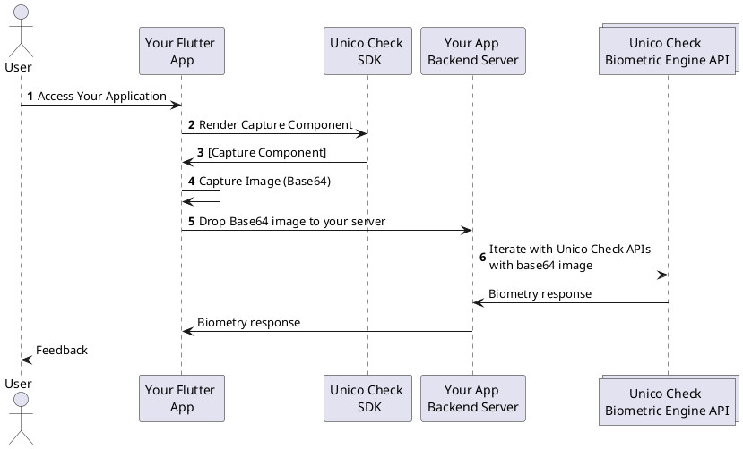

# Visão Geral

## Sobre este SDK

O SDK Flutter do **Unico Check** permite a construção, de forma rápida e fácil, de uma grande experiência de captura de Selfies em suas aplicações Flutter Nativas. Fornecemos um componente para que você possa capturar imagens de forma flúida em seu aplicativo, utilizando mecanismos de abertura de câmera modernos e algorítimos de visão computacional.

Além de abstrair toda a complexidade referente a manipulação da câmera, nosso SDK também tem o objetivo de auxiliar no enquadramento das imagens, as otimizando para aumentar a acurácia na resposta do nosso motor biométrico.

## Compatibilidade

### Versões de iOS e Android

O componente de captura disponibilizado por meio de nosso SDK da suporte às seguintes versões de iOS e Android:
- **Android**: Versão mínima do SDK Android igual a 21;
- **iOS**: Versão 11 ou superior;

### Dispositívos compatíveis

O SDK Flutter do **Unico Check** é compatível com quase todos os dispositivos que possuam iOS 11 ou aceitem a partir da versão 21 do SDK Android. 

#### Dispositívos iOS.

Você pode conferir a lista com esses dispositivos nos [canais de suporte](https://support.apple.com/pt-br/HT209574) oficiais da Apple.

#### Dispositívos Android.

A tabela a seguir lista os dispositivos Android testados em nossos laboratórios, além da disponibilidade das extensões do fornecedor/fabricante. Algumas extensões listadas podem estar sujeitas a níveis de API ou SKUs específicos do fabricante.

| Dispositivo |	Versão	| Normal	| Smart	| Tipo de teste |
| ----------- | ------- | --------- |------ | ----------- |
| HUAWEY P30 Lite   | 9.0	| Sim	| Sim	| Físico |
| ASUS_X01BDA	    | 10	| Sim	| Sim	| Físico |
| Moto G4	        | 6.0.1	| Sim	| Não	| Físico |
| Moto G8 Power Lite | 10	| Sim	| Sim	| Físico |
| Moto G7 Play | 10 | Sim	| Sim	| Físico |
| Samsung Galaxy A30s SM-A307GT | 10	| Sim	| Sim	| Físico |
| Redmi Note 9 | 10	| Sim	| Sim	| Físico |
| ASUS_Z01KD | 8.0.1	| Sim	| Sim	| Físico |
| Redmi Note 8 Pro | 10	| Sim	| Sim	| Físico |
| Samsung A01 | 10	| Sim	| Sim	| Físico |
| Moto G7 Power | 10	| Sim	| Sim	| Físico |
| Redmi Note 9 Pro | 10	| Sim	| Sim	| Físico |
| LG K22 | 10	| Sim	| Sim	| Físico |
| Moto G5s Plus | 8.1.0	| Sim	| Sim	| Físico |
| Samsung J8 SM-J810M | 8.1.0	| Sim	| Sim	| Físico |
| Xiaomi Mi 8 Lite | 10	| Sim	| Sim	| Físico |
| Galaxy A71 | 11	| Sim	| Sim	| Físico |
| Galaxy S20+ | 11	| Sim	| Sim	| Físico |
| Poco X3 | 10	| Sim	| Sim	| Físico |
| Samsung s10e | 11	| Sim	| Sim	| Físico |
| Moto G6 Play | 9	| Sim	| Sim	| Físico |
| Galaxy A51 | 10	| Sim	| Sim	| Físico |
| LG Q6	| 7	| Sim	| Sim	| Físico |
| Redmi Note 8 | 10	| Sim	| Sim	| Físico |
| Moto one macro | 10	| Sim	| Sim	| Físico |
| Mi 8 Lite | 9	| Sim	| Sim	| Físico |
| HUAWEY ALE-L23 | 5.0	 | Sim	| Não	| Físico (TestLab) |
| NEXUS 9 | 5.0.2	 | Sim	| Não	| Virtual (TestLab) |
| NEXUS 4 | 5.1 | Sim	| Não	| Virtual (TestLab) |
| NEXUS 7 | 5.0.2 | 	Sim	| Não	| Virtual (TestLab) |
| SAMSUNG-SM-G935A | 8.0.0	 | Sim	| Não	| Físico (TestLab) |
| SAMSUNG-SM-G891A | 9 | Sim	| Sim	| Físico (TestLab) |
| SAMSUNG SC-02J | 8.0.0 | Sim	| Sim	| Físico (TestLab) |
| SAMSUNG-SM-G930AZ | 8.0.0 | Sim	| Sim	| Físico (TestLab) |
| Pixel sailfish | 8.0.0 | Sim	| Sim	| Físico (TestLab) |
| SAMSUNG-SM-N960N | 9 | Sim	| Sim	| Físico (TestLab) |
| SAMSUNG-SM-N950N | 9 | Sim	| Sim	| Físico (TestLab) |
| SAMSUNG-SM-N960U1 | 8.1.0 | Sim	| Sim	| Físico (TestLab) |
| SAMSUNG-SM-N960F | 9 | Sim	| Sim	| Físico (TestLab) |
| SAMSUNG-SM-N950U | 8.0.0 | Sim	| Sim	| Físico (TestLab) |
| SAMSUNG-SM-G981U1 |  10 | Sim	| Sim	| Físico (TestLab) |
| SAMSUNG-SM-N950F|  9 | Sim	| Sim	| Físico (TestLab) |
| SAMSUNG-SM-G965N | 9 | Sim	| Sim	| Físico (TestLab) |
| SAMSUNG-SM-G965U1| 8.0.0 | Sim	| Sim	| Físico (TestLab) |
| SAMSUNG-SM-J727V | 8.1.0 | Sim	| Sim	| Físico (TestLab) |
| HUAWEY ANE-LX-2 | 9 | Sim	| Sim	| Físico (TestLab) |
| HUAWEY ANE-LX-1 | 9  | Sim	| Sim	| Físico (TestLab) |
| HUAWEY MHA-L29 | 7.0  | Sim	| Sim	| Físico (TestLab) |
| HUAWEY NEO-L29 | 9  | Sim	| Sim	| Físico (TestLab) |
| HUAWEY COR-L29 | 8.1.0  | Sim	| Sim	| Físico (TestLab) |

## Funcionalidades disponíveis 

Atualmente, nosso SDK Flutter possui as seguintes funcionalidades disponíveis:

- Reconhecimento fácil;
    - Captura com Camêra Manual;
    - Captura com Camêra Inteligênte;
    - Captura com prova de vida (Smartlive com interação Facetec);
- Captura de documentos;

:::info Fallback para *Câmera Inteligente* 

Alguns celulares antigos podem não possuir suporte aos recursos necessários para o funcionamento das técnologia de visão computacional utilizadas em nossa funcionalidade de *Câmera Inteligente*.

Nestes casos, a funcionalidade de *Câmera Normal* irá ser acionada como fallback, permitindo que o usuário faça a captura manual.

:::

## Como funciona este SDK?

Nosso SDK, client-side, é responsável por simplificar sua integração com o **Unico Check**, abstraindo toda a complexidade referente a manipulação da câmera e captura de imagens.

Caso a captura seja feita com sucesso, nosso SDK irá retornar um objeto que deverá ser enviado para as nossas APIs, completando assim a validação biométrica.

1. O Usuário acessa sua aplicação;
2. Através de nosso SDK, sua aplicação solicita o frame para captura (conforme configurado em sua aplicação);
3. Sua aplicação renderiza nosso frame para captura em um placeholder pré estabelecido;
4. Sua aplicação captura a imagem (de forma automática, manual ou com o liveness com interação), gerando um token `JWT`;
5. Sua aplicação repassa o `JWT` para seu servidor; 
6. Seu servidor interage com as nossas APIs para validar a imagens (A documentação de nossas APIs pode ser encontrada [neste link](https://www3.acesso.io/identity/services/v3/docs/))
7. Nossos servidores retornam a resposta da validação biométrica, que é repassada para sua aplicação;

## Precisando de ajuda?

Esperamos ter ajudado com este artigo. Não encontrou algo ou ainda precisa de ajuda? Disponibilizamos as seguintes opções para que você possa obter ajuda:

- Caso já seja um parceiro, você também pode entrar em contato através de nossa [Central de Ajuda](https://ajuda.unico.io/hc/pt-br/categories/360002344171);

## Próximos passos

Ótimo! Você chegou até aqui =). A seguir vamos te mostrar como importar nosso SDK em seu projeto e como seguir com a implementação.

- [Como Começar - Importando nosso SDK](como-comecar);
- [Guia para implantação de captura de Selfies](fluxos/captura-selfies);
- [Guia para implantação de captura de documentos](fluxos/captura-documentos);
- [Referencias do SDK](referencias);