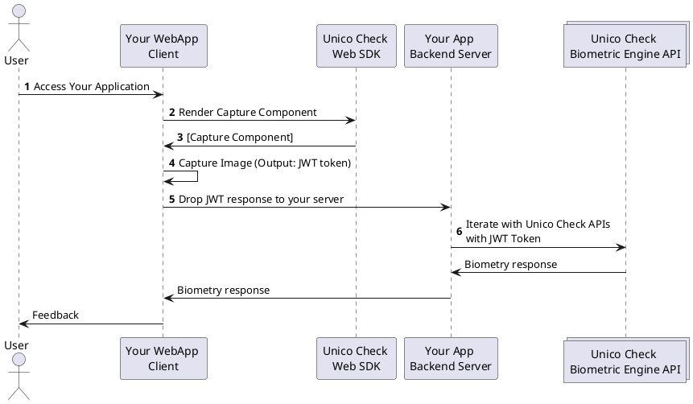

# Visão Geral

## Sobre este SDK

O SDK Web do **Unico Check** permite a construção, de forma rápida e fácil, de uma grande experiência de captura de Selfies em suas aplicações Web. Fornecemos um componente para que você possa capturar imagens de forma flúida em seu aplicativo, utilizando mecanismos de abertura de câmera modernos e algorítimos de visão computacional.

Além de abstrair toda a complexidade referente a manipulação da câmera, nosso SDK também tem o objetivo de auxiliar no enquadramento das imagens, as otimizando para aumentar a acurácia na resposta do nosso motor biométrico.

Nosso SDK Web utiliza os recursos nativos do HTML 5, JavaScript e CSS e funciona em todos os browsers modernos.

## Compatibilidade

### Sistemas Operacionais

O frame de captura, disponibilizado por meio de nosso SDK, da suporte aos seguintes sistemas operacionais e versões:
- **iOS**: A partir da 11.0
- **Android**: A partir da 5.1

Além de sistemas operacionais de dispositivos móveis, também oferecemos compatibilidade a **Windows** e **MacOs**.

:::caution

Nas versões desktop o usuário pode encontrar dificuldades em efetuar as capturas (ou mesmo em ter as imagens validadas pelo motor biométrico) devido a má qualidade de algumas câmeras VGA.

:::

### Browsers

O frame de captura disponibilizado por meio de nosso SDK, é compatível com as seguintes combinações de browsers e sistemas operacionais:

| Sistema operacional  | Chrome  | Firefox  | Opera  | Edge  | Safari |
|--------------------|---------|----------|--------|-------|--------|
| Windows (desktop)  |  |  |   |   |    |
| Android            |  |  |  |  |  |
| iOS mobile/Macbook |  |  |  |  |  |

De forma geral, nosso SDK da suporte a WebRTC e versões mais recentes dos browsers listados acima. Por questões de compatibilidade e segurança, não garantimos o funcionamento em versões muito antigas destes browsers.

:::caution Atenção 

Não damos suporte á WebView ou Browsers de fábrica.

:::

## Funcionalidades disponíveis 

Atualmente, nosso SDK Web possui as seguintes funcionalidades disponíveis:

- Reconhecimento fácil;
    - Captura com Camêra Manual;
    - Captura com Camêra Inteligênte;
    - Captura com prova de vida (Smartlive com interação Facetec);
- Captura de documentos;

<!-- Acho que vale a pena trazer a explicação do que é cada funcionalidade pra ca... Validar com o Truffi -->

:::info Fallback para *Câmera Inteligente*

Alguns celulares antigos, como aparelhos com Android 6 ou iPhone 4, podem não possuir suporte aos recursos necessários para o funcionamento das técnologia de visão computacional, como face-api e tjfs, que são utilizadas em nossa funcionalidade de *Câmera Inteligente*.

Nestes casos, a funcionalidade de *Câmera Normal* irá ser acionada como fallback, permitindo que o usuário faça a captura manual.

Este tipo de fallback não está disponível para a captura com prova de vida (Smartlive com interação);

:::

## Como funciona este SDK?

Nosso SDK, client-side, é responsável por simplificar sua integração com o **Unico Check**, abstraindo toda a complexidade referente a manipulação da câmera e captura. 

Caso a captura seja feita com sucesso, nosso SDK irá retornar um objeto que deverá ser enviado para as nossas APIs, completando assim a validação biométrica.

1. O Usuário acessa sua aplicação;
2. Através de nosso SDK, sua aplicação solicita o frame para captura (conforme configurado em sua aplicação);
3. Sua aplicação renderiza nosso frame para captura em um placeholder pré estabelecido;
4. Sua aplicação captura a imagem (de forma automática, manual ou com o liveness com interação), gerando um token `JWT`;
5. Sua aplicação repassa o `JWT` para seu servidor; 
6. Seu servidor interage com as nossas APIs para validar a imagens (A documentação de nossas APIs pode ser encontrada [neste link](https://www3.acesso.io/identity/services/v3/docs/))
7. Nossos servidores retornam a resposta da validação biométrica, que é repassada para sua aplicação;

## Precisando de ajuda?

Esperamos ter ajudado com este artigo. Não encontrou algo ou ainda precisa de ajuda? Disponibilizamos as seguintes opções para que você possa obter ajuda:

- Caso já seja um parceiro, você também pode entrar em contato através de nossa [Central de Ajuda](https://ajuda.unico.io/hc/pt-br/categories/360002344171);

## Próximos passos

Ótimo! Você chegou até aqui =). A seguir vamos te mostrar como importar nosso SDK em seu projeto e como seguir com a implementação.

- [Como Começar - Importando nosso SDK](como-comecar);
- [Guia para implantação de captura de Selfies](fluxos/captura-selfies)
- [Guia para implantação de captura de documentos](fluxos/captura-selfies)

